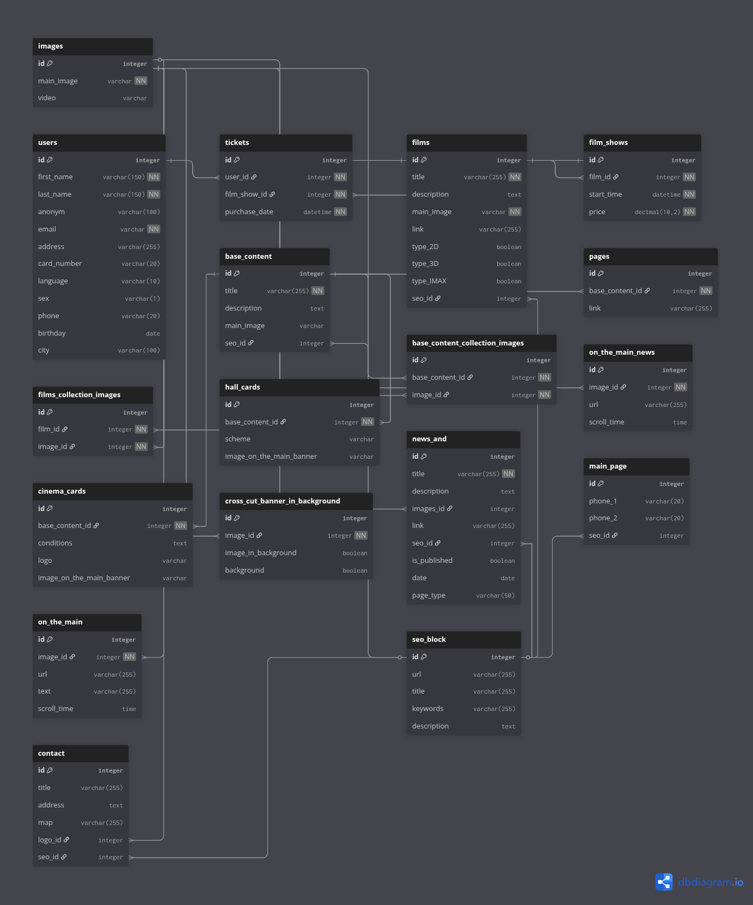

# 🎬 CinemaProject

**CinemaProject** — веб-платформа для управління інформацією про фільми, кіносеанси та кінотеатри.  
Користувачі можуть реєструватися, переглядати афішу, новини, інформацію про зали та кінотеатри.  
Адміністратор має можливість керувати всім контентом через кастомну адмінку.

---

## ✨ Функціонал

- 👤 Реєстрація та профіль користувача  
- 🎟️ Купівля квитків на фільми  
- 🎬 Перегляд фільмів, розкладу та цін  
- 📰 Новини та банери на головній сторінці  
- 🏛️ Інформація про кінотеатри та зали  
- 📞 Контактні дані та SEO-блоки для оптимізації сайту  
- ⚙️ Кастомна адмін-панель для управління вмістом  

---

## 🛠 Технології

- Python 3.11+  
- Django 4.x  
- PostgreSQL (як основна БД)  
- SQLite (для розробки)  
- Pillow (обробка зображень)  
- Bootstrap 5 / TailwindCSS (інтерфейс)  
- Redis + Celery (для розсилок та асинхронних задач)  

---

## Database schema

